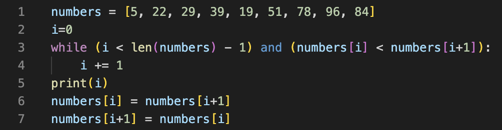
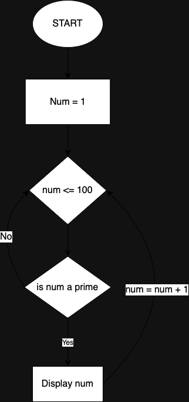

# Coder Academy T1A1-Workbook - Willem Gibson


## Q1: **Identify** and **explain** common and important components and concepts of web development markup languages.
The most common and important components of web development markup languages are as follows:

**1. Elements and Tags:** HTML documents are composed of elements named tags. These tags act as container to hold information. For example `<p> Text Here </p>` would display plain text as a paragraph and need to be closed using a `</tag>`. Another concept used in HTML is semantic HTML, this refers to the use of the in-built tags like `section` & `article` instead of `<div>` or `<span>`.

**2. Atrributes:** Now that we have a bunch of containers, how do we make them look pretty? This is where atrributes come in. These are used to make it easier to call individual elements. By using `class` & `id` we can call these elements seperate from others. Whereas, atrributes such as `src` & `href` are used to attach a file, link or image to an element.

**3. Document Structure:** These tags, like `<DOCTYPE`, `<head>` & `<body>` are used to distinguish the sctructure of a HTML file. They each have there own designated reason. For example, everything in the `<body>` tag is main and VISABLE content, whereas, everything in the `<head>` tag is used for metadata and therefore is NOT VISABLE.

---

## Q2:	**Define** the features of the following technologies that are essential in terms of the development of the internet:
 - packets
 - IP addresses (IPv4 and IPv6)
 - routers and routing
 - domains and DNS

> **Explain** how each technology has contributed to the development of the internet.

### Packets:

A packet refers to a small unit of data that is passed over a network. These are essetnial to the packet-switching style of internet that is the most common in today's society. This unit of data can include almost all types of data depending on the use case of the packet. Packets allow the most effiecent and robust way of communication of the network and in conjunction with TCP (Transmission Control Protocol) is responsible for sending and recieving data throughout the entire internet.

### IP Addresses (IPv4 and IPv6): 

A IP Address or Internet Protocol Address is a numeric label given to each computer that connect to the internet. Each device is given a unique one and it is possible to change them using certain techniques and/or software such as a VPN(Virtual Private Network). These addressess serve two main purposes: Identifying the device and providing the location of the device. There are two main versions of IP Addresses, IPv4 & IPv6. IPv4 using a 32 bit length and IPv6 using 128 bit length, they are both used to connected more and more device to the internet as it grows in users.

### Routers and Routing: 

A router is a device that allows computers to connect computer to computer to make up the internet. Their primary function is to find and execute the best path for data (Packets) to travel through the devices to get to it's intended destination. Routing is process that determines this path. The path is determined by many factors, including where that data needs to be sent, the state of connection to the network and the routing algorithem to use.

### Domains and DNS: 

A domain is a readable version of an IP Address or a group of them. It's a much easier way of finding them, for example instead of `142.250.189.174` you can use `https://google.com` both will take you to the google search engine page, but one is definately easier to remember and type. A DNS or Domain Name System, on the other hand is the most common way to translate those readable domains into the original IP Addresses, allowing the computer to locate and connect with eachother.

---

## Q3:	**Define** the features of the following technologies that are essential in terms of the development of the internet:
 - TCP
 - HTTP and HTTPS
 - web browsers (requests, rendering and developer tools)

> **Explain** how each technology has contributed to the development of client and server communication over the internet (50 - 150 words for each technology)

### Transmission Control Protocol (TCP):

TCP or Transmission Control Protocol is one of the core components the Internet. It is the most reliable and efficient way of communication between devices on the internet. TCP is also used to authenicate the data being transmitted and makes sure it doesn't contain any unwanted data. Some key features of TCP include: 

**- Connection-Oriented Connection:** TCP creates and connection between two devices before exchanging any data, maintains it and then ends it after the interaction between the two devices has ended

**- Flow Control:** TCP in also responsible for the flow of data. It manages the rate at which the data is sent and prevents any fast senders from crowding the network (like in a DoS Attack).

**- Port Numbers:** TCP uses port numbers to identify specific applications and/or services on a device. These numbers in conjunction with the IP address is used in the routing of data.

### HTTP and HTTPS: 

HTTP or Hypertext Transfer Protocol is teh foundation of data sending on the internet. It is an applicaiton layer protocol used to transfer hypertext and all it's multimedia between a client and a server. HTTPS is an exntention of HTTP that provides a layer of security when recieving data from the server, hence the term Hypertext Transfer Protocol Secure. Some key features of HTTP & HTTPS include:

**- Encryption:** Only in HTTPS, this allows the extra layer of security when requuesting data from the server.

**- Request-Response Model:** This means you will only recieve data from a server when you requested by, for example, clicking a link.

**- Authentication:** Also only in HTTPS, this makes sure that the server you are requesting data from the server isn't unsafe.

### Web Browsers(Requests, Rendering and Developer Tools)

Web browsers are software applications for recieving, presenting and navigating information passed over the internet. They act as a graphical interface for users to interact with websites and web apps. Browsers are the sole perpuse for making the internet accessible to a wide range of users. Some key feaures of a web browser include

**- HTTP Requests:** A browser allows you to request information from a web server to display as a website/web app.

**- Request Methods:** Browsers can use different methods to achieve this. Methods like `GET`, `POST`, `PUT` & `DELETE` can be used to control the flow of data from the server.

---

## Q4:	**Identify** THREE data structures used in the Python programming language and **explain** the reasons for using each.

In python there are many different in-built structures that play pretty inportant roles. Here are 3 examples of those:

**1. Dictionaries:** Dictionaries are used to store key-value pairs to allow the retrival of data via a defined key. For example, if I wanted to call the color red in this example: `Fruit {'apple': 'Red'}` then I would call apple as it is assign the value of red. The reason for these are to allow developers an fast and easy way to retieve data and are very flexible.

**2. Sets** Sets are used to create an unordered collection or data. These are perfect and eliminating duplicate entries and support set mathematical operations such as union, intersection and difference.

**3. Lists** Lists are used to create an ordered collection or data and are extremely customisible, hence why they are one of the most commonly used structures. If you need to, you can add, remove, edit during the programs execution.

---

## Q5:	**Describe** the features of interpreters and compilers and how they are different.

### Interpreters:

Interpeters are a type of language processor that executes while you code line by line, it makes sure you aren't making an errors and helping you create code faster. Some key featurs include:

**- Line-by-line Execution:** This allows the interpreter to scan over your code and show you errors and better ways to code something while you code.

**- Imediate Feedback:** Becausae of this line-by-line approach, an interpreter can give you imediate feedback on every line of code.

### Compilers: 

A compiler is a language processor used to translate all your source code into a finished product. It is what allows you to create those executible applications from just a bunch of files. Some key features include:

**- Optimisation:** Most compilers will have a hand in the optimisation of the code you created. This allows it to run smoother on any device.

**- Program Distribution:** A compiler allows you to realse a useable version of your code for most devices.

---

## Q6:	**Identify** TWO commonly used programming languages and **explain** the benefits and drawbacks of each.
### Python:

**Benefits**

**- Readability and Simplicinty:** Python was made with the mindset of simiplicity is key, so the learning curve of Python isn't as high as many other languages

**- Versitility:** Python can be used for almost anything, whereas some other lanuage were created with the sole purpose of one objective, for example HTML.

**- Community Support:** Python's community is probably the best part about Python. The community is massive and every is making python great and great through differnet modules and addons.

**Drawbacks**

**- Performance:** WHile Python is great for most things, it is no where near as fast as say C++. Hence why pythong is almost never used in things like video games, that require very fast execution.

**- Globle Interpreter Lock (GIL):** This simply means that it is locked to only 1 thread and isn't able to access multithreading with a CPU, hence why it doesn't make for a fast executible language.

### C++:

**Benefits**

**- Performance:** C++ is known for it's high performance and low memory manipulation. This means it is super suitable for projects such as video games as it's a super fast executible language.

**- Object-Oriented:** C++ supports both procedual and object oriented paradigms, allowing developers a very flexible architecture to work with.

**Drawbacks**

**- Complexity:** With great power comes... alot to learn. C++ has a steep learning curve but once learnt it is very useful

**- Verbose Syntax:** C++ code can be more verbose than some other language, for example Python. It may take more lines of code to achieve certain objectives.

---

## Q7: **Identify** TWO ethical issues from the areas below and **discuss** the extent to which an IT professional is ethically responsible in terms of the issue.

List of topics containing ethical issues:
 - access to a user’s personal information (medical, family, financial, personal attributes such as sexuality, religion, or beliefs)
 - intellectual property, copyright, and acknowledgement.
 - criminal acts such as theft, fraud, trafficking and distribution of prohibited substances, terrorism
 - GPS tracking data and other types of metadata, MAC addresses, hardware fingerprints
 - freedom of thought, conscience, speech and the media
 - aggressive sales and marketing practices designed to mislead and deceive consumers
 - trading of shares on the stock exchange OR cryptocurrencies

> For each ethical issue identify a source of legal information relating to the ethical issue and discuss whether the
> law is helpful in assisting a developer to act in an ethical way. (Word count guide: 200 words max)

> Conduct **research** into a case study of **ONE** of the ethical issues you have chosen **discuss** how an ethical IT
> professional should respond to the case study and how they might mitigate or prevent ethical breaches. (Word count 
> guide: 400 - 600 words)

### Ethical issue #1:
A common eethical issue in software development is the issue with accessing user's personal data, when needed of course. The main issue with this is that you may not have the user's permission to do this, which can lead to alot of ethical and legal issues. Another issue is that one user may have different prefferences for their private data than others and this complexity is what us developers have to conform to. A great way around this is a privacy policy. A policy allows you to have, in writing, exactly how and what the user's person data will be used for and can be used as a signed form of consent in court. 

### Ethical issue #2:
Another very common ethical issue, espically for social media platforms is the ethical issues of freedom of speak. Freedom of speech is the idea that anyone can say anything wihtout punishment in the effort of free thought. Whether you agree with this belief or not, it is something a software engineer needs to keep in mind while creating a personal sharing platform such as a social media platform. To protect yourself from your user's comments on your platform in America the first amendment does protect platforms, whereas in australia we have no form right to freedom of speech.

### Case Study:
**Case Study: Ethics and freedom of speech in the platform X**.

**Background:**
As a widely used social media platform X (formally known as twitter), it has the reputation of giving all users a chance of free speech. Millions of users everyday, it is now one of the biggesy players in social media world, linking people around the world. Despite this fact, the platform has been experiencing many ethical issues regarding freedom of speech that have tested the limits of its commitment to freedom of speech and openness/inclusion.

**Issue 1: Moderation Policies and Content Removal:**
X also tries to balance between the freedom of speech and creating an orderly and civil environment. This raises serious concerns in the ethics involved in content deletion, which is part of the current moderation policy intended to prohibit hate speech and harassment. The line is so thin for many people arguing that the platform’s algorithms may unintentionally squash free speech.

**Legal Perspective:**
Acceptable behaviors are defined through community guidelines and the terms of services agreements. These complaints are typically issues with the existing stature on anti-discrimination and hate speech at the local level. However, the problem comes in when such rules are implemented on different social and political platforms that might introduce some form of bias in content moderation.

**Ethical Responsibility:**
First, it should strike a balance between upholding freedom of speech and safeguarding its users from harm when it comes to platform X. Trust building through transparent practices of content moderation, clear communication with users on the reasons for deletion of certain content as well as regular updates to moderation algorithms are necessary measures for conducting ethical practices.

**Issue 2: Amplification of Misinformation:**
The threat to freedom of speech on X comes in the form of spreading false information and information that was intentionally distorted. Sometimes, the platform’s algorithm driven content recommender feeds on lies and helps in further propagating false narratives. It raises ethical concerns that can affect public opinion, promote social division, and threaten democratic debate.

**Legal Perspective:**
Although law does not necessarily target the distribution of fake news through electronic systems, there are more calls to regulate the role of the digital platform as a host of information disseminated. Some countries have proposed such laws as a strategy of eliminating the spread of fake news on online platforms.

**Ethical Responsibility:**
Therefore, X should tackle the issue of ethics concerning misinformation directly. The government should promote fact-checking and work on scaling up the algorithms for less misinformation, as well as cooperate with devlelopers to come up with accurate approaches.

To conclude, the situatiuon with the platform X trying to balance the fine line between freedom speech and protection of its users illustrates a prime example of the ethical & legal issues of freedom of speech on online platforms.

---

## Q8: Explain control flow, using examples from the Python programming language
Control flow refers to the order in which individual statements, instructions or functions are executed. In a Python programs the control flow is governed by the execution of statements, loops and function calls.

Some examples include:


**if Statements:**
```
x = in(input("Enter a number: "))

if x < 0:
    x = 0
    print("No negative numbers!)
elif x == 0:
    Print("Congrats you got zero")
else:
    print(x)
```

**range() function:**
```
for i in range(1, 100)
    print(i)
```

**Break and Continue Statements:**
```
for i in range(1, 5):
    for x in range(1, n):
        if n % x == 0:
            print(n, 'equals', x, '*', n//x)
            break
    else:
        # loop fell through without finding a factor
        print(n, 'is a prime number')
```

---

## Q9: Explain the difference between type coercion and type conversion. Are either of these used in Python?
The main difference between type coercion and type conversion is that type coercion is always implicit, whereas type type converion can be either implicit or explicit. This basicaaly means that type conversion refers to the general process of changing a type and coercion is to the implied conversion of a type. Now does Python use these methods? No Python doesn't have coercion but of course it has conversion of data types. An example of this is change a int into a string in Python:
```
x = int(input("Enter a number to turn into a string: ))

x = string(x)
```

---

## Q10: Explain data types, using examples:
A data type is a term used in computer science to refer to a grouping of data, usually with a predicted outcome. For an example is an integer, which refers to all whole number related data. Now in Python we have Text, Numeric, Sequence, Mapping, Boolean, Binary & None types of data. Here is am example of each:

**Text types:**
```
x = "Hello World"
```

**Integer types:**
```
x = 10
```

**Float types:**
```
x = 1.0
```

**Complex types:**
```
x = 2j
```

**List types:**
```
x = ["Dave", "Charles", "Bob"]
```

**Tuple types:**
```
x = ("Dave", "Charles", "Bob")
```

**Dictionary types:**
```
x = {
    Name: "Charles", 
    Friend: "Bob",
    Age: 16}
```

**Set types:**
```
x = {"Dave", "Charles", "Bob"}
```

**Range types:**
```
x = range(1, 10)
```

**Frozen set types:**
```
x = frozenset({"Dave", "Charles", "Bob"})
```

**Boolean types:**
```
x = False
```

**Byte types:**
```
x = b"Hello"
```

**Byte array types:**
```
x = bytearray(5)
```

**Memory View types:**
```
x = memoryview(bytes(5))
```

**None types:**
```
x = none
```

---

## Q11:	Here’s the problem: “There is a restaurant serving a variety of food. The customers want to be able to buy food of their choice. All the staff just quit, how can you build an app to replace them?”
 - Identify the classes you would use to solve the problem
 - Write a short explanation of why you would use the classes you have identified

Using the following classes:

- ```Menu class:``` This class will be used to represent the food items offered at the restruant. It would include properties like name, price, ingredients and the method to create it. And include a method to display the food.

- ```Order class:``` This class will be used to represent an order that has been placed by a customer. It would include properties like the customer's name, ordered food, and the cost. It would also have methods to add and remove food items from the order and calculate their total cost.

- ```Customer class:``` This class will be used to represent a customer visiting the restaurant. It would include properties such as the customer's name and contact information and have methods to place an order and view their order history.

- ```Restaurant class:``` This class will be used to represent the restaurant. It would include properties such as a menu of food items and a list of orders. It also has methods to display the menu, take orders and handle payments.

I used these groups of classes as the easiest way to manage everything required to do by the quitting staff. The ```Menu``` class is used to display and manage all the food items for both the restraunt and the customers. The ```Order``` class is used as a way for the restraunt to complete, manage and edit orders that come in from customers. The ```Customer``` class is used to help the management of waiting tables and payment processing for the business, and is used to make sure the customers get what they ordered. The ```Restaurant``` class is used to tied everything together and make sure everything flows correctly.

---

## Q12:	Identify and explain the error in the code snippet below that is preventing correct execution of the program


The input needs to be a integer to execute:
```
celsius = int(input())

fahrenheit = (celsius * 9 / 5) + 32

print(f"The result is: {fahrenheit}.")
```

---

## Q13:	The code snippet below looks for the first two elements that are out of order and swaps them; however, it is not producing the correct results. Rewrite the code so that it works correctly.


```
numbers = [5, 22, 29, 39, 19, 51, 78, 96, 84]
i = 0

while (i < len(numbers) - 1) and (numbers[i] < numbers[i + 1]):
  i += 1

if i < len(numbers) - 1:
  temp = numbers[i]
  numbers[i] = numbers[i + 1]
  numbers[i + 1] = temp

print(numbers)
```

---

## Q14: Demonstrate your algorithmic thinking through completing the following two tasks, in order:
 1. Create a flowchart to outline the steps for listing all prime numbers between 1 and 100 (inclusive). Your flowchart should make use of standard conventions for flowcharts to indicate processes, tasks, actions, or operations
 2. Write pseudocode for the process outlined in your flowchart
 

 ```
Start

num = 1  // Initialization

while num <= 100:
    is_prime = check_primality(num)  // Check if num is prime
    
    if is_prime:
        display_or_store(num)  // Process the prime number

    num = num + 1  // Increment to the next number

End

 ```

---

## Q15:	Write pseudocode OR Python code for the following problem:
*You have access to two variables: raining (boolean) and temperature (integer). If it’s raining and the temperature is less than 15 degrees, print to the screen “It’s wet and cold”, if it is less than 15 but not raining print “It’s not raining but cold”. If it’s greater than or equal to 15 but not raining print “It’s warm but not raining”, and otherwise tell them “It’s warm and raining”*.
```
# Input
raining = input("Is it raining? T or F? ") # Set to True or False based on the scenario
temperature = int(input("What temp is it? ")) # Set to the actual temperature value

# Conditions
if raining and temperature < 15:
    print("It’s wet and cold")
elif not raining and temperature < 15:
    print("It’s not raining but cold")
elif temperature >= 15 and not raining:
    print("It’s warm but not raining")
else:
    print("It’s warm and raining")

```

---

## Q16:	ACME Corporation are hiring a new junior developer, as part of their hiring criteria they've created a "coding skill score" based on the specific competencies they require for this role; the more important the skill is for ACME corp, the more points it contributes to the "coding skill score" The skills are weighted as follows:
- Python (1)
- Ruby (2)
- Bash (4)
- Git (8)
- HTML (16)
- TDD (32)
- CSS (64)
- JavaScript (128)

>### **Write a program that allows a user to input their skills and then tells them:**

- a)Their overall "coding skill score" 
- b) Skills they may want to learn, and how much each one would improve their score

```
# Define the skill weights
skill_weights = {
    'Python': 1,
    'Ruby': 2,
    'Bash': 4,
    'Git': 8,
    'HTML': 16,
    'TDD': 32,
    'CSS': 64,
    'JavaScript': 128
}

def calculate_skill_score(user_skills):
    total_score = sum(skill_weights.get(skill, 0) for skill in user_skills)
    return total_score

def suggest_skills(current_skills):
    missing_skills = [skill for skill in skill_weights if skill not in current_skills]
    suggestions = {skill: skill_weights[skill] for skill in missing_skills}
    return suggestions

def main():
    # Get user input for skills
    user_skills = input("Enter your skills, separated by commas (e.g., Python,HTML,JavaScript): ").split(',')

    # Calculate overall coding skill score
    overall_score = calculate_skill_score(user_skills)
    print(f"\nYour overall coding skill score is: {overall_score}")

    # Suggest skills to improve the score
    suggestions = suggest_skills(user_skills)
    if suggestions:
        print("\nSkills you may want to learn:")
        for skill, weight in suggestions.items():
            print(f"{skill}: {weight} points")

if __name__ == "__main__":
    main()

```

---

# References:
- Varagouli, E. (2021). What Each Markup Language Is Used For. [online] Semrush Blog. Available at: https://www.semrush.com/blog/markup-language/.
- ThoughtCo. (n.d.). What Are Markup Languages? [online] Available at: https://www.thoughtco.com/what-are-markup-languages-3468655.
- Wikipedia Contributors (2019). Markup language. [online] Wikipedia. Available at: https://en.wikipedia.org/wiki/Markup_language.
- Cloudflare. (n.d.). What is a packet? | Network packet definition. [online] Available at: https://www.cloudflare.com/en-au/learning/network-layer/what-is-a-packet/ [Accessed 6 Dec. 2023].
- Kaspersky (2021). What is an IP Address – Definition and Explanation. [online] www.kaspersky.com. Available at: https://www.kaspersky.com/resource-center/definitions/what-is-an-ip-address.
- What is a router? | Router definition | Cloudflare. (n.d.). Cloudflare. [online] Available at: https://www.cloudflare.com/en-au/learning/network-layer/what-is-a-router/.
- Cloudflare. (n.d.). What is routing? | IP routing. [online] Available at: https://www.cloudflare.com/en-au/learning/network-layer/what-is-routing/ [Accessed 6 Dec. 2023].
- Wikipedia Contributors (2019). Domain name. [online] Wikipedia. Available at: https://en.wikipedia.org/wiki/Domain_name.
- Fortinet. (n.d.). What Is Domain Name System (DNS)? [online] Available at: https://www.fortinet.com/resources/cyberglossary/what-is-dns#:~:text=DNS%20Definition.
- Fortinet (2021). What is TCP/IP and How does it work? [online] Fortinet. Available at: https://www.fortinet.com/resources/cyberglossary/tcp-ip.
- CloudFlare (n.d.). Why is HTTP not secure? | HTTP vs. HTTPS | Cloudflare. Cloudflare. [online] Available at: https://www.cloudflare.com/en-au/learning/ssl/why-is-http-not-secure/.
- Wikipedia Contributors (2019). Web browser. [online] Wikipedia. Available at: https://en.wikipedia.org/wiki/Web_browser.
- Corporate Finance Institute. (n.d.). Python Data Structures. [online] Available at: https://corporatefinanceinstitute.com/resources/data-science/python-data-structures/# [Accessed 6 Dec. 2023].
- Python, R. (n.d.). Common Python Data Structures (Guide) – Real Python. [online] realpython.com. Available at: https://realpython.com/python-data-structures/.
- builtin.com. (n.d.). Compiler vs. Interpreter in Programming | Built In. [online] Available at: https://builtin.com/software-engineering-perspectives/compiler-vs-interpreter.
- Wikipedia. (2020). Interpreter (computing). [online] Available at: https://en.wikipedia.org/wiki/Interpreter_(computing).
- Wikipedia. (2020). Compiler. [online] Available at: https://en.wikipedia.org/wiki/Compiler.
- pangea.ai. (n.d.). A Guide to C++: Advantages and Disadvantages | Pangea.ai. [online] Available at: https://pangea.ai/blog/languages/a-comprehensive-guide-to-c-advantages-and-disadvantages#:~:text=C%2B%2B%20offers%20excellent%20performance%2C%20memory [Accessed 6 Dec. 2023].
- Novotny, J. (2023). A Programmers’ Guide to Python: Advantages & Disadvantages. [online] Linode Guides & Tutorials. Available at: https://www.linode.com/docs/guides/pros-and-cons-of-python/.
- Cheatsheet, P. (n.d.). Python Control Flow - Python Cheatsheet. [online] www.pythoncheatsheet.org. Available at: https://www.pythoncheatsheet.org/cheatsheet/control-flow.
- docs.python.org. (n.d.). 4. More Control Flow Tools — Python 3.8.3 documentation. [online] Available at: https://docs.python.org/3/tutorial/controlflow.html.
- developer.mozilla.org. (2023). Type coercion - MDN Web Docs Glossary: Definitions of Web-related terms | MDN. [online] Available at: https://developer.mozilla.org/en-US/docs/Glossary/Type_coercion# [Accessed 6 Dec. 2023].
- www.stevefenton.co.uk. (n.d.). Type Coercion vs Type Conversion. [online] Available at: https://www.stevefenton.co.uk/blog/2021/08/type-coercion-vs-type-conversion/.
- Wikipedia Contributors (2019). Data type. [online] Wikipedia. Available at: https://en.wikipedia.org/wiki/Data_type.
- W3schools (n.d.). Python Data Types. [online] www.w3schools.com. Available at: https://www.w3schools.com/python/python_datatypes.asp.
‌- https://digitalprivacy.ieee.org/publications/topics/ethical-issues-related-to-data-privacy-and-security-why-we-must-balance-ethical-and-legal-requirements-in-the-connected-world#:~:text=Ethical%20Challenges&text=You%20might%20not%20know%20the,same%20as%20another%20individual%27s%20wishes.
- https://ethics.org.au/ethics-explainer-freedom-of-speech/
- https://blog.twitter.com/en_us/topics/company/2023/stand-with-x-to-protect-free-speech#:~:text=Despite%20our%20clear%20and%20consistent,those%20of%20their%20financial%20supporters.
